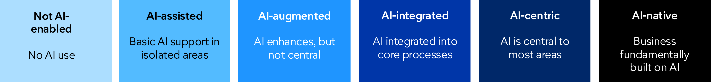

# Message
We’d like to thank you for the time and energy you brought to PAC’s AI strategy retreat. Your insights are shaping a clear AI roadmap for Tarleton State.

Three clear priorities emerged from our time together:

- Accelerate Student Retention and Success Through AI
- Integrate AI Across the Curriculum and Create AI Certificates
- Enhance Service and Operations Through AI

The foundational enablers of these three priorities will be to:

- Equip our faculty and staff to use AI effectively and responsibly, 
- Resource AI initiatives/projects adequately
- Provide guidance and guardrails to keep our data and systems safe

To help us prioritize steps to move from strategy to action in the coming year, would you please complete [THIS] survey by [DEADLINE].

We’re excited for the journey ahead! Thank you again for your contributions.

All PAC members received access to M365 CoPilot Pro for one month which will expire on 8/31. If you would like to continue your license at $18 per month, please contact ITS through [Laura Isbell](LISBELL@tarleton.edu) and provide an account number.
[we can drop this if desired, but the information needs to go out to PAC so including it at the end here saves another email]

# Survey
- Where should Tarleton be on the AI ambition spectrum

- Rank these AI-focused initiatives from highest to lowest priority
    - Accelerate Student Retention and Success
        - Tutoring and academic support
        - Advising and degree planning
        - Early-alert for at-risk students
        - Personalized student communications
        - Career readiness and job placement
        - Student services and problem resolution
    Other ideas: (Open response)

    - Integrate AI Competencies Across the Curriculum and Create AI Certificates
        - Identify core AI competencies for every Tarleton graduate
        - Integrate AI into existing academic programs
        - Create new AI projects, internships, and experiential - learning opportunities
        - Launch AI certificates/microcredentials for students and working professionals
        - Develop industry partnerships to align AI skills with workforce needs   
    Other ideas: (Open response)
    [combined 2 similar items]

    - Enhance Service and Operations
        - Streamline business processes and automate routine tasks
        - Improve service speed and quality
        - Increase employee productivity through AI-enabled tools
        - Enhance access to institutional knowledge and data-informed decision support
    Other ideas: (Open response)

- Rank these training formats from most to least effective for your team
    - 5 min videos on a specific topic (on-demand)
    - In-person workshops
    - Coursera-style learning paths (on-demand)
    - embedded in your team meetings
    - [please suggest additional options]

- Suppose we offer advanced training to equip a member of your team as your AI champion to faciliate your team's AI journey and develop tailored AI solutions.
    - Would you support this with funding and dedicated time & effort?
    - Do you have someone who would want this role?

- As we plan to integrate AI into our curriculum
    - What suggestions do you have
    - What challenges do you foresee

- As we plan to equip our faculty and staff to use AI effectively and responsibly
    - What suggestions do you have
    - What challenges do you foresee

